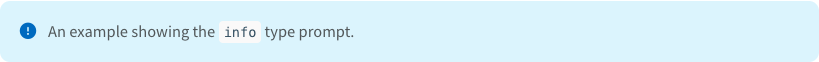
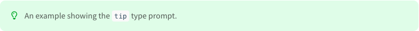
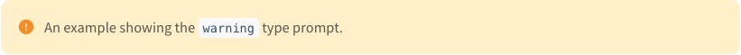

# About
이 블로그는 `Jekyll`(정적사이트 생성 프레임워크)의 `Chirpy`테마를 적용 해 만들었습니다.
기존 마크다운 형식의 글을 Chirpy를 통해 게시함에 있어서,
적용 되지 않는 마크다운 및 마크업 문법, Chirpy에서 지원하는 추가적인 문법들,
그리고 Chirpy를 사용함에 있어서 주의사항 등을 정리 해 두려고 합니다.
(저의 경우 마크다운 에디터로 `옵시디언`을 사용하고 있으며,
내용 상 실제 마크다운 문법이 아닌 <font color="#ff0000">옵시디언에서만 적용</font>되는 문법이 포함되어 있을 수 있습니다.)

# 포스팅 미지원 & 지원 사항
## Chirpy 미지원
### 마크다운 미지원
- 헤더5`#####`,헤더 6`######`이 적용되지 않습니다.
-  디바이더`---`가 적용되지 않습니다.

### 마크업 미지원
-  iframe을 통한 영상삽입이 지원되지 않습니다.

## Chirpy 지원
### 유튜브 영상삽입
```

```
-  유튜브 영상주소(`https://www.youtube.com/watch?v=__영상ID__`) 중 `__영상ID__`부분을 위의 `__영상ID__`에 입력합니다.
- 예시) 첨부하고자 하는 유튜브 영상의 주소가`https://www.youtube.com/watch?v=dsM9IJMDe3k`일 경우
	- ``

### 이미지 삽입
#### 기본값(폭 100%)
```

````
- 예) ``


#### 폭 75%, 폭 50%(가운데정렬)
- 폭 75%
```
{:.w-75}
````
- 폭 50%
```
{:.w-50}
````
- 예) `{: .w-75}` <- 폭 75%로 가운데정렬

#### 왼쪽정렬
```
{: .normal}
````
- 예) `{: .w-75 .normal}` <- 폭 75%로 왼쪽정렬

#### 왼쪽, 오른쪽에 띄우기
- 띄운 이미지 반대쪽에 글자가 입력 됨
- 왼쪽에 띄우기
```
{: .left}
````
- 오른쪽에 띄우기
```
{: .right}
````
- 예) `{: .w-50 .left}` <- 폭 50%로 왼쪽에 띄움


### prompt박스 삽입
#### 특이사항
- 여러 줄로 작성해도 한 줄로 들어가게 됩니다.
- 내부에서 헤더 작성시 이상해지므로 자제합니다.
#### info

```
> 내용
{: .prompt-info}
```

#### tip

```
> 내용
{: .prompt-tip}
```

#### warning

```
> 
{: .prompt-warning}
```

#### danger

```
> 내용
{: .prompt-danger}
```


# 깃헙배포시 유의사항
### 포스트 디렉터리 관리
- `_posts`디렉터리 내부의 디렉터리명은 **영어**사용 또는 **띄어쓰기 금지**
	- chirpy는 `_posts` 디렉터리 내부의 모든 글들을 읽어오므로, 작성자는 `_posts`디렉터리 내부 구조를 원하는데로 만들 수 있습니다.
		- 물론 실제 사이트에 반영되는 계층구조는 포스팅 `frontmatter`의 `categories`속성 순서를 따릅니다.
	- 다만 디렉터리 명이 한글이면서 띄어쓰기가 존재하면, Github Action으로 배포까지는 문제가 없는데 제대로 정적사이트가 렌더링 되지 않는 문제가 있습니다.(20240326 기준)
	- 이런 문제를 사전에 방지하려면, 디렉터리명을 아예 영어로 구성하던지 아니면 띄어쓰기 대신 `_`(under score)를 사용하는 것이 좋습니다.